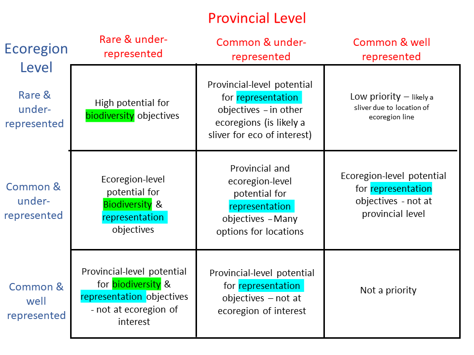

<style type="text/css">
  body{
  font-size: 20pt;
}
</style>

```{r setup, include=FALSE}
knitr::opts_chunk$set(echo = FALSE, fig.width = 10, fig.height = 8, warning = FALSE, message = FALSE)
source("packages.R")
conflicted::conflict_prefer("filter", "dplyr")
ecoregion_subset <- c("NCM", "TOP")

geom_bc <- geom_sf(data = bc_bound(), fill = NA, size = 0.2)

is_html <- knitr::is_html_output()
is_pdf <- knitr::is_latex_output()
```

```{r tar-load}
tar_load(c("map_pa_background", "map_eco_bec_background", "pa_eco_bec_summary", "pa_eco_bec_summary_wide", 
           "map_bec_background", "pa_bec_summary_wide", "map_eco_background", "parks_removed"))
```

- Protected Area coverage of BGC Variants (207) and Ecoregions (47)
- 789 unique combinations of BGC Variants x Ecoregions
- Protected Areas = Canadian Protected and Conserved Areas Database
  - Parks and Protected Areas + OECMs
  - Mostly only looked at PPAs

```{r prov-bec-rep-map}
prov_bec_summary_sf <- map_bec_background %>% 
  left_join(pa_bec_summary_wide, by = c("zone", "subzone", "variant"))

ggplot() + 
  geom_bc + 
  geom_sf(data = prov_bec_summary_sf, mapping = aes(fill = percent_conserved_ppa), colour = NA) +
  #geom_sf(data = map_pa_background, fill="white", alpha = 0.4) +
  scale_fill_viridis_c() + 
  labs(title = "Representation of BEC variants in B.C. Parks and Protected Areas", 
       fill = "Percent of variant protected") + 
  theme_minimal()
```

```{r bec-comp-vs-rep-scatter}
comp_by_rep_bec <- dplyr::filter(pa_bec_summary_wide)

bec_cols <- bec_colours()[unique(comp_by_rep_bec$zone)]

p <- ggplot(comp_by_rep_bec, aes(x = percent_comp_prov, y = percent_conserved_ppa, colour = zone)) +
  geom_point(aes(text = bgc_label)) +
    scale_colour_manual(values = bec_cols, breaks = names(bec_cols)) + 
  labs(title = "Percent of BGC variant conserved in PPAs vs Composition in B.C.",
       x = "Percent variant composition in B.C.",
       y = "Percent of variant conserved in B.C.", 
       colour = "BGC Zone") +
  theme_bw()

if (is_html) ggplotly(p, tooltip = "text") else p
```

Variants can be spread widely across the province, and looking at the provincial variant analysis does not provide information about where greater protection of a variant should occur - to achieve this we intersected with Ecoregions 

```{r ecoregion-var-facet-scatter}
comp_by_rep <- dplyr::filter(pa_eco_bec_summary, pa_type == "ppa", 
                             ecoregion_code %in% ecoregion_subset)

bec_cols <- bec_colours()[unique(comp_by_rep$zone)]

comp_by_rep_plot <- ggplot(comp_by_rep, aes(x = percent_comp_ecoregion, y = percent_conserved, colour = zone)) +
  geom_point(aes(text = bgc_label)) +
    scale_colour_manual(values = bec_cols, breaks = names(bec_cols)) +
  facet_wrap(vars(ecoregion_name)) +
  labs(title = "Percent of BEC variant conserved in PPAs vs composition in two selected Ecoregions",
       x = "Percent variant composition of ecoregion",
       y = "Percent of variant conserved in ecoregion", 
       colour = "BGC Zone") +
  theme_bw()

if (is_html) ggplotly(comp_by_rep_plot, tooltip = "text") else comp_by_rep_plot
```


```{r map-eco-bec-subset}
map_eco_bec <- parks_removed %>%
  left_join(pa_eco_bec_summary_wide, 
            by = c("ecoregion_name", "ecoregion_code", "zone", "subzone", "variant")) %>%
  filter(ecoregion_code %in% ecoregion_subset)
```

```{r eco-rep-map-subset}
eco_rep_map <- ggplot() +
  geom_bc + 
  geom_sf(data = map_eco_bec, mapping = aes(fill = percent_conserved_ppa), colour = NA) +
  scale_fill_viridis_c() +
  labs(title = "Percent of BEC Variants protected in Northern Columbia Mountains and\nThompson Okanagan Plateau ecoregions",
       fill = "percent of BEC variant\n in ecoregion") + 
  theme_minimal()

eco_rep_map
```

```{r eco-rep-map-subset-with-pa, cache=TRUE}
eco_var_rep_map_with_pa <- eco_rep_map +
  geom_sf(data = map_pa_background, fill="white", alpha = 0.4, size = 0.2) +
  coord_sf(xlim = st_bbox(map_eco_bec)[c(1,3)], ylim = st_bbox(map_eco_bec)[c(2,4)]) +
  labs(colour = "Conserved area type") +
  theme_minimal()

eco_var_rep_map_with_pa
```


```{r prov-eco-bec-rep-map}
prov_eco_bec_summary_sf <- parks_removed %>% 
  left_join(pa_eco_bec_summary_wide, 
            by = c("ecoregion_name", "ecoregion_code", "zone", "subzone", "variant"))

ggplot() + 
  geom_bc + 
  geom_sf(data = prov_eco_bec_summary_sf, aes(fill = percent_conserved_ppa), colour = NA) +
  geom_sf(data = map_eco_background, fill = NA, colour = "grey80", size = 0.2) + 
  scale_fill_viridis_c() + 
  labs(title = "Representation of BEC variants x Ecoregions\n in B.C. Parks and Protected Areas\n PPAs & OECMs removed", 
       fill = "Percent of BGC VariantxEcoregion\nprotected") + 
  theme_minimal()
```

Questions:

- What thresholds do we set for representation for different conservation scenarios?
- Even representation vs higher level of conservation for rare variants?

Due to intersection of variants with ecoregions we can create slivers of a variant within an ecoregion, 
leading to artificial rarity - need to balance local rarity/representation vs provincial.




```{r eco-bec-comp-vs-rep-scatter, eval=FALSE}
comp_by_rep_eco_bec <- dplyr::filter(pa_eco_bec_summary_wide)

bec_cols <- bec_colours()[unique(comp_by_rep_eco_bec$zone)]

p <- ggplot(comp_by_rep_eco_bec, 
            aes(x = percent_comp_ecoregion, y = percent_conserved_ppa, colour = zone)) +
  geom_point(aes(text = paste0(ecoregion_name, "*", bgc_label))) +
    scale_colour_manual(values = bec_cols, breaks = names(bec_cols)) + 
  labs(title = "Percent of BEC Variant x Ecoregion conserved in PPAs vs Composition\n PPAs & OECMs removed",
       x = "Percent variant x ecoregion composition in B.C.",
       y = "Percent of variant x ecoregion conserved in B.C.") +
  theme_bw()

if (is_html) ggplotly(p, tooltip = "text") else p
```

```{r underrep-eco-bec-map}
rare_variants <- filter(pa_bec_summary_wide, 
                        percent_comp_prov < quantile(percent_comp_prov, .05))
ggplot() + 
  geom_bc + 
  geom_sf(
    data = prov_eco_bec_summary_sf %>% 
      filter(percent_conserved_ppa < 17, 
             (percent_comp_ecoregion > 5 | bgc_label %in% rare_variants$bgc_label)), 
    aes(fill = percent_conserved_ppa), colour = NA
  ) +
  scale_fill_viridis_c() + 
  labs(title = "Underrepresented BEC variants x Ecoregions\n in B.C. Parks and Protected Areas\n PPAs & OECMs removed", 
       caption = "Ecoregions*Variants with < 17% protected,\nwhere the variant makes up at least 5% of an ecoregion\nor is provincially rare (in the bottom 5% of variants)", 
       fill = "Percent protected") + 
  theme_minimal()
```

```{r underrep-eco-bec-map-1.5}

ggplot() + 
  geom_bc + 
  geom_sf(
    data = prov_eco_bec_summary_sf %>% 
      filter(percent_conserved_ppa < 17, 
             (percent_comp_ecoregion > 1.5 | bgc_label %in% rare_variants$bgc_label )), 
    aes(fill = percent_conserved_ppa), colour = NA
  ) +
  scale_fill_viridis_c() + 
  labs(title = "<17% protected, >1.5% composition", 
       caption = "Ecoregions*Variants with < 17% protected,\nwhere the variant makes up at least 1.5% of an ecoregion\nor is provincially rare (in the bottom 10% of variants)", 
       fill = "Percent protected") + 
  theme_minimal()
```


```{r underrep-eco-bec-map-25}

ggplot() + 
  geom_bc + 
  geom_sf(
    data = prov_eco_bec_summary_sf %>% 
      filter(percent_conserved_ppa < 25, 
             (percent_comp_ecoregion > 3 | bgc_label %in% rare_variants$bgc_label )), 
    aes(fill = percent_conserved_ppa), colour = NA
  ) +
  #geom_sf(data=map_pa_background, fill="white")+
  scale_fill_viridis_c() + 
  labs(title = "<25% protected, >3% composition", 
       caption = "Ecoregions*Variants with < 25% protected,\nwhere the variant makes up at least 3% of an ecoregion\nor is provincially rare (in the bottom 10% of variants)", 
       fill = "Percent protected") + 
  theme_minimal()
```

```{r underrep-eco-bec-map-30}

ggplot() + 
  geom_bc + 
  geom_sf(
    data = prov_eco_bec_summary_sf %>% 
      filter(percent_conserved_ppa < 30, 
             (percent_comp_ecoregion > 3 | bgc_label %in% rare_variants$bgc_label )), 
    aes(fill = percent_conserved_ppa), colour = NA
  ) +
  scale_fill_viridis_c() + 
  labs(title = "<30% protected, >3% composition", 
       caption = "Ecoregions*Variants with < 30% protected,\nwhere the variant makes up at least 3% of an ecoregion\nor is provincially rare (in the bottom 10% of variants)", 
       fill = "Percent protected") + 
  theme_minimal()
```


```{r summary-barplot, eval=FALSE}
eco_rep_barplot <- ggplot(dplyr::filter(pa_eco_bec_summary, ecoregion_code %in% ecoregion_subset)) +
  geom_col(aes(x = reorder_within(bgc_label, percent_conserved, ecoregion_name, fun = sum), y = percent_conserved, fill = pa_type)) +
  facet_grid(vars(ecoregion_name), scales = "free_y") +
  coord_flip() +
  scale_fill_discrete(na.translate = FALSE) +
  scale_x_reordered() +
  labs(fill = "Conserved Area Type", y = "Percent Conserved", x = "BEC Variant",
       title = paste0("Percent of BEC Variant x Ecoregion conserved")) +
  theme(axis.text.y = element_text(size = 8))
eco_rep_barplot
```

